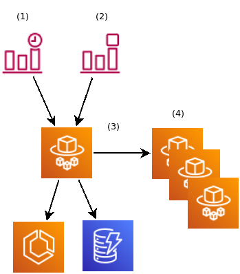

# Mirror Images in/out of AWS using ECR, Batch & Lambda

This repository builds on the work started in [aws-codebuild-podman]. Using the plumbing from that project, 
we can build containers with [skopeo] capable of running in [AWS Batch][batch] to mirror images in and out
of our ECR repositories.

Using the below technologies, we'll automate mirroring images into and out of the 
AWS cloud:

| AWS service          | Description
|----------------------|------------
| [Batch][batch]       | Managed, batch environment. This is perfect for highly-parallel and/or long-running jobs.      
| [ECR][ecr]           | Managed container image repository.
| [Lambda][lambda]     | Functional execution in response to events. This can be custom events, but also events within the AWS cloud.
| [SQS][sqs]           | Managed queueing. Queue entries serve as jobs for AWS Batch and also as event sources for AWS Lambda.
| [DynamoDB][dynamodb] | Scalable NoSQL storage for easy key/value storage and retrieval across many AWS services and APIs.

This repository provides the templates and descriptions needed to provision container image repositories
and the build jobs needed to use [skopeo] in AWS Batch.

## Capabilities

- [ ] Create all required resources with [CloudFormation][cloudformation]
- [ ] Mirror changed images into AWS periodically
- [ ] Mirror changed images to external repositories on push

## Intended Design

1. A CloudWatch timer of the user's choosing invokes a lambda.
2. The Lambda identifies if the previous mirroring activity has completed.
   1. If the previous job is still running, generate an error (adjustments will need made)
   2. If not, submit the control job
3. The control batch job loops over the DynamoDB table
   1. Identify if the SHAs still match from source/target
   2. If not, submit a copy/mirror job
4. The mirror jobs run a `skopeo copy --all` from src->dest

## Pre-requisites

- [aws-codebuild-podman] tools & resources configured and available in your account

## Costs

AWS costs are charged by resource usage and time. These stacks will provide a best-effort
tear down of the resources consumed when stacks are deleted. To help identify items 
in your account which may lead to items on your bill, here is a helpful checklist
(in addition to those from [aws-codebuild-podman]:

- [DynamoDB pricing][dynamodb-pricing]
- [Lambda pricing][lambda-pricing]

[aws-codebuild-podman]: https://github.com/cuppett/aws-codebuild-podman
[cloudformation]: https://aws.amazon.com/cloudformation/
[batch]: https://aws.amazon.com/batch/
[dynamodb]: https://aws.amazon.com/dynamodb/
[dynamodb-pricing]: https://aws.amazon.com/dynamodb/pricing/
[ecr]: https://aws.amazon.com/ecr/
[lambda]: https://aws.amazon.com/lambda/
[lambda-pricing]: https://aws.amazon.com/lambda/pricing/
[sqs]: https://aws.amazon.com/sqs/
[skopeo]: https://github.com/containers/skopeo
